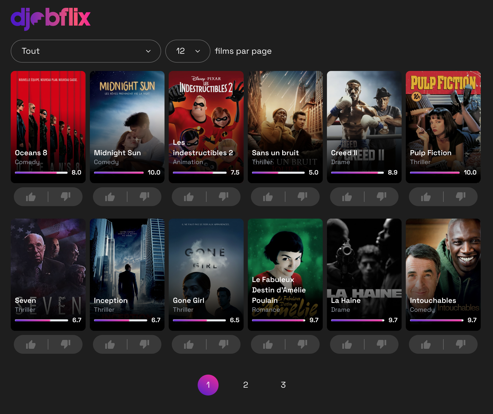

Voici une proposition de README.md pour votre projet djobflix :

```markdown

# Djobflix




Djobflix est une plateforme d'affichage de films développée dans le cadre d'un test technique pour Djob, une startup innovante.

## Description

Cette application web permet aux utilisateurs de consulter une liste de films. Elle a été conçue pour démontrer les compétences techniques en développement front-end, notamment avec React et TypeScript.

## Technologies utilisées

- React
- TypeScript
- pnpm (gestionnaire de paquets)

## Installation

Pour installer et exécuter ce projet localement, suivez ces étapes :

1. Clonez le dépôt :
   ```
   git clone https://github.com/votre-nom-utilisateur/djobflix.git
   ```

2. Naviguez dans le répertoire du projet :
   ```
   cd djobflix
   ```

3. Installez les dépendances avec pnpm :
   ```
   pnpm install
   ```

4. Lancez l'application en mode développement :
   ```
   pnpm dev
   ```